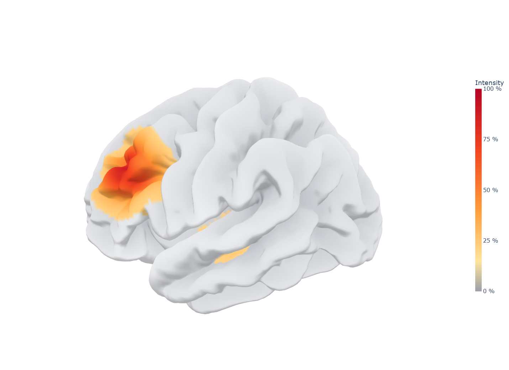
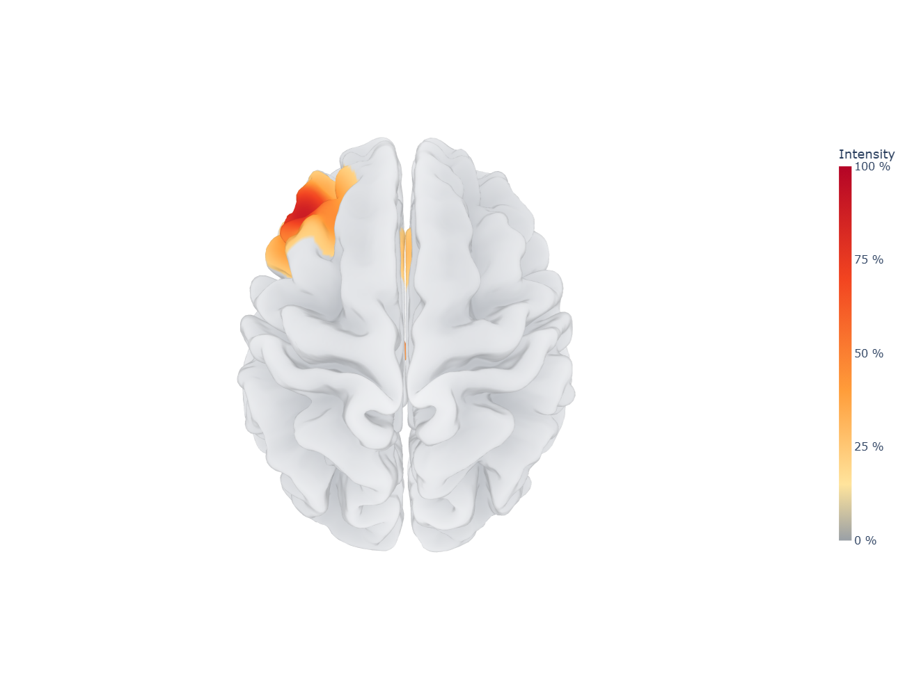
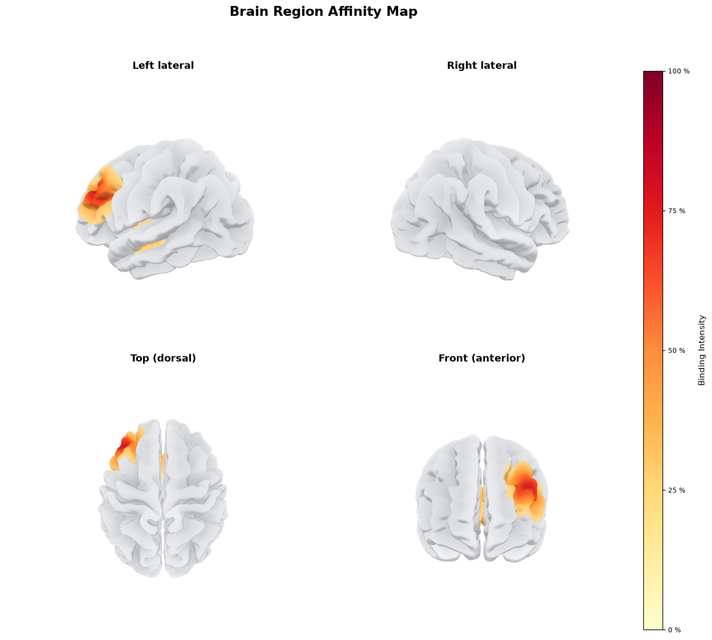
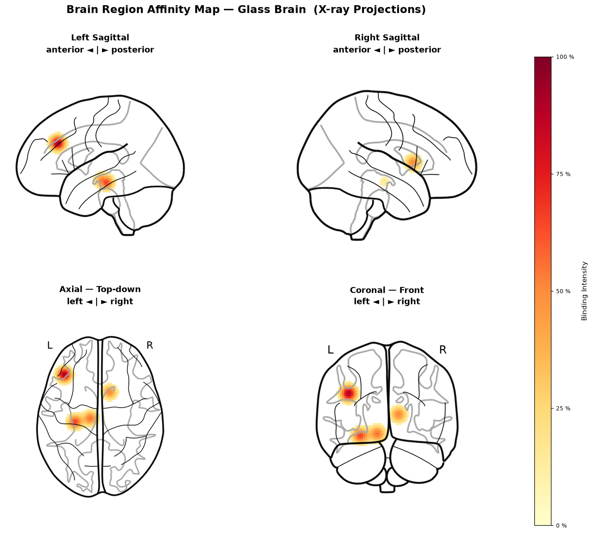
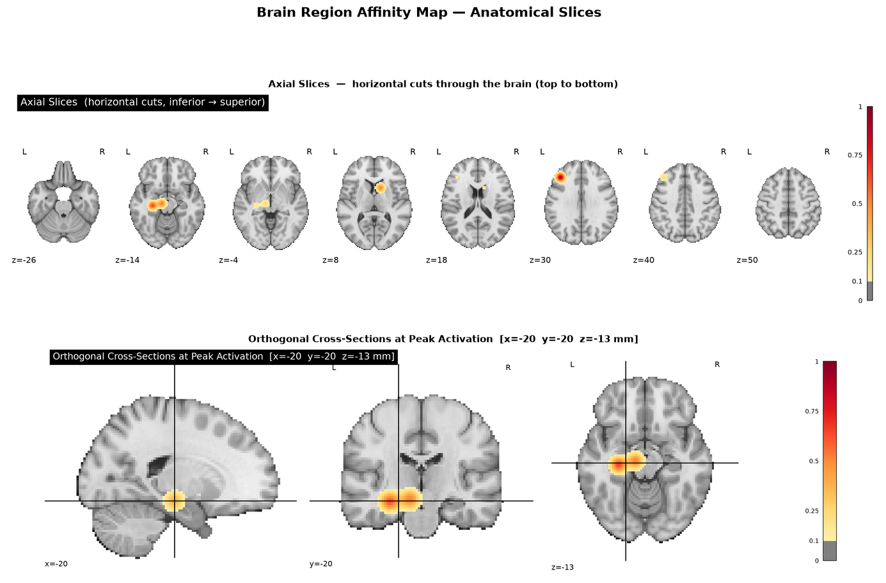
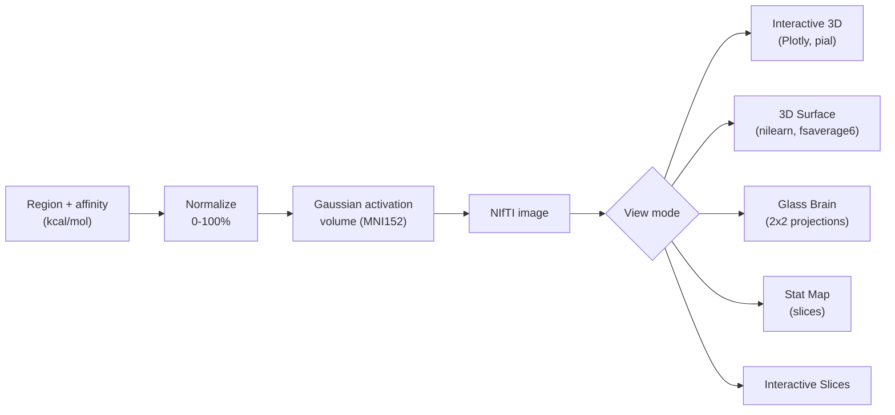

# 🧠 Neuro-Target Affinity Visualizer

Turn protein / drug-target **binding affinities** into intuitive **heat maps on a
3-D brain**. Enter one or more brain regions with an affinity value (in
`kcal/mol`) and see *where* — and how strongly — a target is predicted to engage
across cortical and subcortical structures, rendered five different ways
including a fully rotatable 3-D model.



> *Interactive 3-D view — a light, folded cortex (real gyri & sulci) with a
> gray→red affinity heat map on the affected region. Drag to rotate.*

The model is fully rotatable — the same map viewed from above:



---

## Table of contents
- [Features](#features)
- [Pipeline](#pipeline)
- [Installation](#installation)
- [Launch](#launch)
- [Usage](#usage)
- [View modes](#view-modes)
- [Project structure](#project-structure)
- [Documentation](#documentation)
- [Scientific scope](#scientific-scope)
- [Supported brain regions](#supported-brain-regions)
- [Troubleshooting](#troubleshooting)
- [License](#license)

---

## Features

- **Five visualization modes** (see [below](#view-modes)):
  Interactive 3-D · 3-D Surface · Glass Brain · Stat Map · Interactive Slices.
- **Rotatable 3-D brain** with real cortical folds and a gray→red intensity map.
- **Rendering controls** — display-threshold slider, surface resolution
  (`fsaverage5/6/full`), inflated ↔ pial toggle.
- **Binding-affinity summary** — per-region bars with strength tags.
- **Written interpretation** of the result + a **methods / provenance** panel
  for reproducibility.
- Clean, bright, brain-inspired UI. Runs entirely locally.

| 3-D Surface | Glass Brain | Stat Map |
|:---:|:---:|:---:|
|  |  |  |

---

## Pipeline



1. You enter a brain region and a binding affinity in `kcal/mol` (more negative =
   stronger binding).
2. The value is clamped to `[-15, -1]` and mapped linearly to a **0–100 %**
   normalized intensity.
3. Each region's **MNI152** coordinate becomes the centre of a 3-D **Gaussian
   blob** stamped into a `91 × 109 × 91` volume; overlapping regions sum.
4. The volume is rendered with **nilearn** (static views) or **Plotly Mesh3d**
   (the interactive 3-D brain). Core logic lives in `visualization.py`.

---

## Installation

### Prerequisites
- **Python 3.13** recommended (3.11+ works)
- **git** (to clone)

### Steps

```bash
git clone https://github.com/<your-username>/neuro-target-visualizer.git
cd neuro-target-visualizer

# create an isolated environment
python -m venv .venv

# Windows
.venv\Scripts\python.exe -m pip install --upgrade pip
.venv\Scripts\python.exe -m pip install -r requirements.txt

# macOS / Linux
# source .venv/bin/activate
# pip install --upgrade pip && pip install -r requirements.txt
```

The first run downloads the `fsaverage` brain-surface meshes (via nilearn) into a
local cache — this happens once.

---

## Launch

**Windows — one click:** double-click **`start_app.bat`**. It creates the virtual
environment and installs dependencies on first run, then opens the app.

**Any OS — manual:**

```bash
# Windows
.venv\Scripts\python.exe -m streamlit run app.py
# macOS / Linux
streamlit run app.py
```

The app opens at **http://localhost:8501**. To run a second copy on another port:
`streamlit run app.py --server.port 8502`.

---

## Usage

1. In the **sidebar**, choose a **brain region** from the dropdown.
2. Enter a **binding affinity** in `kcal/mol` (e.g. `-9.2`). More negative =
   stronger, more favourable binding.
3. Click **➕ Add Region**. Repeat to add several regions; remove any with **✕**,
   or **🗑️ Clear All**.
4. Pick a **View Mode** at the top (default: **Interactive 3D** — drag to rotate,
   scroll to zoom).
5. Tune the **Rendering** controls in the sidebar:
   - **Display threshold** — hide faint activation below a chosen intensity.
   - **Surface resolution** — `fsaverage5` (fast) → `fsaverage6` (sharp) → `fsaverage` (finest).
   - **Inflated surface** — inflated (see into sulci) vs. pial (folded).
6. Below the brain, read the **Binding Affinity Summary** (per-region bars +
   strength tags), the **Interpretation** (strongest site, distribution), and the
   **Methods & provenance** panel.

---

## View modes

| Mode | Engine | Best for |
|---|---|---|
| **Interactive 3D** | Plotly (WebGL) | Rotatable exploration; light folded cortex + gray→red heat map |
| **3D Surface** | nilearn `plot_img_on_surf` | Publication-style multi-angle cortical panels |
| **Glass Brain** | nilearn `plot_glass_brain` | Deep activation via full-depth X-ray projections (2×2) |
| **Stat Map** | nilearn `plot_stat_map` | Precise anatomical localization on MRI slices |
| **Interactive Slices** | nilearn `view_img` | Scrubbing a cross-hair through deep/subcortical structures |

---

## Project structure

```
neuro-target-visualizer/
├── app.py                 # Streamlit UI: theme, controls, view router, summary
├── visualization.py       # activation-volume builder + all renderers
├── brain_regions.py       # 25 regions → MNI coordinates
├── requirements.txt       # Python dependencies
├── start_app.bat          # Windows launcher (self-bootstraps the venv)
├── .streamlit/
│   └── config.toml        # UI theme
├── ENHANCEMENT_REPORT.md  # implemented features, roadmap, scientific scope
├── docs/
│   └── Brain_Vault_v2/    # Obsidian documentation vault (notes + images)
└── README.md
```

---

## Documentation

`docs/Brain_Vault_v2/` is an **Obsidian vault** documenting the whole project as a
linked knowledge graph: full-source notes for every file (`Code_Graph/`),
per-feature design notes, a change log, and an image `Gallery`. Open that folder
as a vault in Obsidian and press `Ctrl+G` to explore the graph. A high-level
roadmap and scope statement live in `ENHANCEMENT_REPORT.md`.

---

## Scientific scope

This is a **visualization and intuition** tool. Affinity values are
**user-entered**; the app uses **no** measured PET / mRNA data and no docking
engine. The maps show **predicted localization and relative strength** — not
measured receptor occupancy or in-vivo concentration. `ENHANCEMENT_REPORT.md`
describes how real ground-truth data (PET receptor-density atlases, parcellations,
molecule input) could be integrated in future work.

---

## Supported brain regions

Striatum (Caudate / Putamen), Nucleus Accumbens, Prefrontal Cortex (DLPFC / VMPFC),
Orbitofrontal Cortex, Anterior / Posterior Cingulate Cortex, Hippocampus, Amygdala,
Thalamus, Hypothalamus, Substantia Nigra, Ventral Tegmental Area, Raphe Nuclei,
Locus Coeruleus, Insula, Cerebellum, Primary Motor Cortex, Somatosensory Cortex,
Visual Cortex (V1), Auditory Cortex, Temporal Pole, Parietal Cortex (SPL),
Globus Pallidus.

---

## Troubleshooting

- **Port already in use** — a copy is already running; open http://localhost:8501,
  or launch with `--server.port 8502`.
- **First render is slow** — the 3-D surface downloads `fsaverage` meshes on first
  use and caches them; subsequent renders are fast.
- **`streamlit` not found** — activate the virtual environment, or call it via
  `.venv\Scripts\python.exe -m streamlit ...`.

---

## License

Released under the **MIT License** — see [`LICENSE`](LICENSE).
