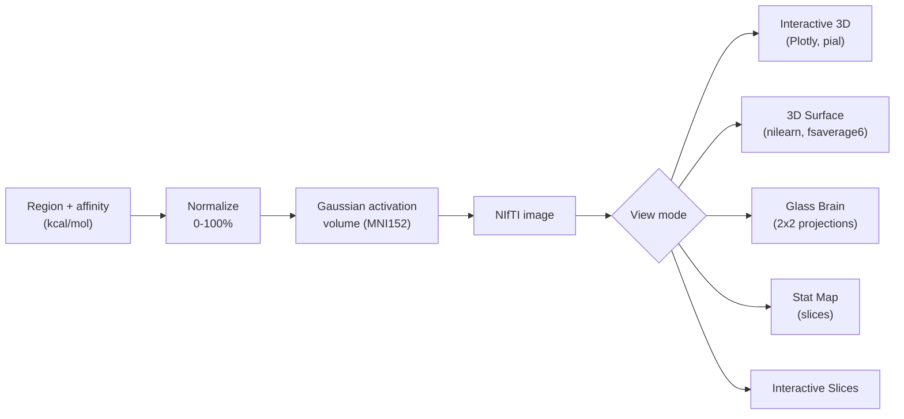

# 🧠 Neuro-Target Affinity Visualizer

[](https://github.com/ayoubriad1/neuroviz-v2/actions/workflows/ci.yml)

> **Deploying this yourself?** See
> [`docs/DEPLOY_HUGGINGFACE.md`](docs/DEPLOY_HUGGINGFACE.md) for a free,
> permanent, no-code deployment guide (Hugging Face Spaces). The YAML block
> above this line is Hugging Face Spaces' required metadata header — it's
> invisible on GitHub's README rendering and harmless everywhere else.

Turn protein / drug-target **binding affinities** into intuitive **heat maps on a
3-D brain**. Enter one or more brain regions with an affinity value (in
`kcal/mol`) and see *where* — and how strongly — a target is predicted to engage
across cortical and subcortical structures, rendered five different ways
including a fully rotatable 3-D model.


> *Interactive 3-D view — a light, folded cortex (real gyri & sulci) with a
> gray→red affinity heat map on the affected region. Drag to rotate.*

The model is fully rotatable — the same map viewed from above:


---

## Table of contents
- [Features](#features)
- [Pipeline](#pipeline)
- [Installation](#installation)
- [Launch](#launch)
- [Usage](#usage)
- [View modes](#view-modes)
- [Project structure](#project-structure)
- [Documentation](#documentation)
- [AI Interpretation](#ai-interpretation)
- [Receptor density weighting](#receptor-density-weighting)
- [Importing docking results](#importing-docking-results)
- [Spatial correspondence test](#spatial-correspondence-test)
- [Circuit propagation (experimental)](#circuit-propagation-experimental)
- [Scientific scope](#scientific-scope)
- [Supported brain regions](#supported-brain-regions)
- [Troubleshooting](#troubleshooting)
- [License](#license)

---

## Features

- **Five visualization modes** (see [below](#view-modes)):
  Interactive 3-D · 3-D Surface · Glass Brain · Stat Map · Interactive Slices.
- **Rotatable 3-D brain** with real cortical folds and a gray→red intensity map,
  a persistent **L/R orientation compass**, and one-click **camera presets**
  (Left/Right/Top/Front/Default) so you never lose your bearings after
  rotating freely.
- **28/28 regions on real, cited atlas masks** (Harvard-Oxford, Pauli et al.
  2017) — no illustrative points remain. See [Scientific scope](#scientific-scope).
- **Rendering controls** — display-threshold slider, surface resolution
  (`fsaverage5/6/full`), and a **colorblind-safe (viridis) color scheme** option
  alongside the default warm gray→red palette.
- **Binding-affinity summary** — per-region bars with strength tags.
- **Written interpretation** of the result + a **methods / provenance** panel
  for reproducibility.
- **Export** — download the current static figure as a high-res PNG, or the
  full affinity summary + interpretation + methods as a Markdown report.
- **Optional AI interpretation** — bring your own Claude or ChatGPT API key
  (configurable in the sidebar, never bundled or paid for by this app) to get
  a short, hallucination-guarded interpretation grounded in general
  neuroscience knowledge. See [AI Interpretation](#ai-interpretation) below.
- **Optional receptor density weighting** — weight the affinity map by one of
  18 real, published PET-derived receptor/transporter density maps (Hansen et
  al. 2022), instead of painting a whole region uniformly. See
  [Receptor density weighting](#receptor-density-weighting) below.
- **Import docking results** — bulk-add regions from a CSV/TSV of docking
  scores instead of re-typing them one by one, or pull the best score
  straight out of an AutoDock Vina result file. See
  [Importing docking results](#importing-docking-results) below.
- **Spatial correspondence test** — when receptor weighting is active and
  at least 3 selected regions have a usable density value, a permutation
  test reports whether your affinity map correlates with the real receptor
  density more than a random set of atlas regions would (with a p-value).
  See [Spatial correspondence test](#spatial-correspondence-test) below.
- **Circuit propagation (experimental)** — an effect doesn't stay confined
  to where it binds. This section estimates, from real functional
  connectivity, which regions you didn't select might still be reached via
  known circuits. See [Circuit propagation](#circuit-propagation-experimental)
  below.
- Clean, bright, brain-inspired UI. Runs entirely locally.

| 3-D Surface | Glass Brain | Stat Map |
|:---:|:---:|:---:|
|  |  |  |

---

## Pipeline



1. You enter a brain region and a binding affinity in `kcal/mol` (more negative =
   stronger binding).
2. The value is clamped to `[-15, -1]` and mapped linearly to a **0–100 %**
   normalized intensity.
3. Each region's **MNI152** coordinate becomes the centre of a 3-D **Gaussian
   blob** stamped into a `91 × 109 × 91` volume; overlapping regions sum.
4. The volume is rendered with **nilearn** (static views) or **Plotly Mesh3d**
   (the interactive 3-D brain). Core logic lives in `visualization.py`.

---

## Installation

### 1. Install Python
Install **Python 3.13** (3.11+ also works) from
[python.org/downloads](https://www.python.org/downloads/). On Windows, tick
**"Add Python to PATH"** during setup.

### 2. Get the code
- **Easiest (no git):** on this GitHub page click the green **`< > Code`** button
  → **Download ZIP**, then unzip it.
- **Or with git:**
  ```bash
  git clone https://github.com/ayoubriad1/neuroviz-v2.git
  ```

Dependencies install themselves the first time you launch (next section).

---

## Launch

### Windows — no coding needed
Open the project folder and **double-click `start_app.bat`**.
On the **first run** it automatically builds a virtual environment and installs
everything (a few minutes, one time), then opens the app in your browser. Later
runs start in a few seconds. **To stop it, close the terminal window.**

### macOS / Linux — no coding needed
Open a terminal in the project folder and run `./start_app.sh` (same
self-bootstrapping behaviour as `start_app.bat`).

### Any OS — manual (command line)
```bash
# 1. create an isolated environment
python -m venv .venv

# 2. install dependencies
.venv\Scripts\python.exe -m pip install -r requirements.txt      # Windows
# source .venv/bin/activate && pip install -r requirements.txt   # macOS / Linux

# 3. launch
.venv\Scripts\python.exe -m streamlit run app.py                 # Windows
# streamlit run app.py                                           # macOS / Linux
```

The app opens at **http://localhost:8501**. The very first render also downloads
the brain-surface meshes once (via nilearn) and caches them. Run a second copy on
another port with `... streamlit run app.py --server.port 8502`.

### Docker (fully reproducible, no local Python needed)
```bash
docker compose up --build
```
Builds a container with the exact dependency set and, network permitting,
pre-downloads the brain-surface meshes and atlas data at build time (so the
first render is instant and works offline). Serves the app at
**http://localhost:7860**. (Port 7860 is also what
[Hugging Face Spaces](docs/DEPLOY_HUGGINGFACE.md) expects, so the same image
deploys there unchanged — some build environments, including HF Spaces, block
network access during the build itself, in which case this download simply
happens lazily on the first real request instead.)

### Exact reproducibility
`requirements.txt` only pins lower bounds. For a fully pinned, hash-verified
environment (recommended before citing results from this tool), install from
[`requirements.lock.txt`](requirements.lock.txt) instead:
```bash
pip install -r requirements.lock.txt
```

---

## Usage

1. In the **sidebar**, pick an **Input mode**:
   - **Named region (atlas-verified)** — choose one of the 28 regions from the
     dropdown (the default, recommended mode).
   - **Exact MNI coordinates (advanced)** — for researchers who already know
     their precise target (e.g. a DBS contact, or a peak coordinate reported
     in a paper): type the X/Y/Z in mm directly. This stamps a single,
     focused point exactly there instead of a whole-region mask, and — unlike
     named regions — is **not** mirrored across the midline, since the point
     was chosen on purpose and may be intentionally one-sided.
2. Enter a **binding affinity** in `kcal/mol` (e.g. `-9.2`). More negative =
   stronger, more favourable binding.
3. Click **➕ Add Region**. Repeat to add several regions; remove any with **✕**,
   or **🗑️ Clear All**.
4. Pick a **View Mode** at the top (default: **Interactive 3D** — drag to rotate,
   scroll to zoom).
5. Tune the **Rendering** controls in the sidebar:
   - **Display threshold** — hide faint activation below a chosen intensity.
   - **Surface resolution** — `fsaverage5` (fast) → `fsaverage6` (sharp) → `fsaverage` (finest).
   - **Color scheme** — the default warm gray→red palette, or a colorblind-safe
     (viridis) alternative.
6. Below the brain, read the **Binding Affinity Summary** (per-region bars +
   strength tags), the **Interpretation** (strongest site, distribution), and the
   **Methods & provenance** panel.

---

## View modes

| Mode | Engine | Best for |
|---|---|---|
| **Interactive 3D** | Plotly (WebGL) | Rotatable exploration; light folded cortex + gray→red heat map |
| **3D Surface** | nilearn `plot_img_on_surf` | Publication-style multi-angle cortical panels |
| **Glass Brain** | nilearn `plot_glass_brain` | Deep activation via full-depth X-ray projections (2×2) |
| **Stat Map** | nilearn `plot_stat_map` | Precise anatomical localization on MRI slices |
| **Interactive Slices** | nilearn `view_img` | Scrubbing a cross-hair through deep/subcortical structures |

---

## Project structure

```
neuroviz-v2/
├── app.py                 # thin orchestrator: page config, wires the modules below
├── config.py              # affinity-scale constants, view modes, per-view guide text
├── styles.py              # theme CSS + hero header / loader HTML
├── models.py              # RegionEntry dataclass, kcal -> normalized-intensity
├── state.py               # typed session_state helpers (add/remove/clear regions)
├── ui_sidebar.py          # sidebar: region picker, active-region list, rendering options
├── ui_views.py            # view-mode selector, subcortical warning, render dispatch
├── interpretation.py      # affinity summary cards, interpretation text, methods panel
├── ai_agent.py            # optional BYOK LLM client (Claude / ChatGPT)
├── ui_ai.py               # sidebar config + trigger for the AI interpretation
├── visualization.py       # activation-volume builder + all renderers
├── brain_regions.py       # illustrative-point fallback (currently empty - see below) + merged name list
├── atlas_regions.py       # 28/28 regions → real atlas masks (Harvard-Oxford, Pauli 2017)
├── receptor_atlas.py      # 18 PET receptor/transporter density maps (Hansen et al. 2022, via neuromaps)
├── spatial_stats.py       # spatial correspondence permutation test (affinity vs. receptor density)
├── docking_import.py      # CSV bulk import + AutoDock Vina result score extraction
├── connectome.py          # circuit-propagation estimate (real functional connectivity)
├── mni_space.py           # shared MNI152 2mm grid constants
├── requirements.txt       # Python dependencies (lower-bound pins)
├── requirements.lock.txt  # exact, hash-verified pins for reproducibility
├── requirements-dev.txt   # + pytest / ruff / mypy
├── pyproject.toml         # ruff / mypy / pytest config
├── tests/                 # tests for models/brain_regions/atlas_regions/visualization
├── start_app.bat          # Windows launcher (self-bootstraps the venv)
├── start_app.sh           # macOS/Linux launcher (same behaviour)
├── Dockerfile             # reproducible container, best-effort mesh/atlas pre-warm
├── docker-compose.yml
├── .env.example           # API keys for the optional AI interpretation agent
├── CITATION.cff           # how to cite this tool
├── .streamlit/
│   └── config.toml        # UI theme
├── ENHANCEMENT_REPORT.md  # implemented features, roadmap, scientific scope
├── data/
│   └── connectivity_matrix.csv   # precomputed 28x28 functional connectivity matrix
├── scripts/
│   └── compute_connectivity_matrix.py   # reproducible derivation of the matrix above
├── docs/
│   └── Brain_Vault_v2/    # Obsidian documentation vault (notes + images)
└── README.md
```

---

## Documentation

`docs/Brain_Vault_v2/` is an **Obsidian vault** documenting the whole project as a
linked knowledge graph: full-source notes for every file (`Code_Graph/`),
per-feature design notes, a change log, and an image `Gallery`. Open that folder
as a vault in Obsidian and press `Ctrl+G` to explore the graph. A high-level
roadmap and scope statement live in `ENHANCEMENT_REPORT.md`.

- **[`CHANGELOG.md`](CHANGELOG.md)** — everything improved in this engineering
  session (performance, real atlases, architecture, design, accessibility, AI
  interpretation), organized by phase.
- **[`docs/AI_AGENT.md`](docs/AI_AGENT.md)** — design notes for the AI
  Interpretation feature specifically: prompt design, BYOK cost model,
  provider abstraction, and testing approach.
- **[`docs/RECEPTOR_WEIGHTING.md`](docs/RECEPTOR_WEIGHTING.md)** — design
  notes for the receptor density weighting feature: data source, license,
  the resampling/normalization pipeline, and how to add another receptor.
- **[`docs/CONNECTOME_PROPAGATION.md`](docs/CONNECTOME_PROPAGATION.md)** —
  design notes for circuit propagation: how the real functional
  connectivity matrix was derived (and how to regenerate it), the linear
  propagation formula, and its caveats.

---

## AI Interpretation

An optional sidebar section lets you generate a short, LLM-written
interpretation of your selected regions, using **your own** Claude or ChatGPT
API key — this tool never bundles, proxies, or pays for API access on your
behalf.

1. In the sidebar, under **🤖 AI Interpretation**, pick a provider (or leave it
   `Disabled`, the default).
2. Paste your API key (kept in the browser session only, never written to
   disk) and, optionally, adjust the model — a small/cheap model is
   preselected (`claude-haiku-4-5-20251001` or `gpt-4o-mini`) to keep costs low.
3. Click **Generate AI interpretation**. The result is cached per region
   selection so moving a slider or switching view mode won't silently trigger
   another paid call.

**What this is not**: it is a single constrained LLM call from general
neuroscience knowledge, not a literature search. The prompt explicitly
forbids inventing citations, PMIDs, or specific studies, and the model is
asked to flag its own confidence as low/moderate — but always verify any
claim against primary sources before relying on it. A fuller, literature-
grounded RAG design (PubMed/Semantic Scholar/OpenAlex retrieval + citation
verification) is sketched in `ENHANCEMENT_REPORT.md` as a future upgrade.

---

## Receptor density weighting

An optional sidebar section, **"Receptor Weighting"**, lets you weight the
rendered map by one of **18 real, published PET-derived receptor/transporter
density maps** (Hansen, Shafiei et al. 2022, Nature Neuroscience, fetched via
the `neuromaps` package) — dopamine (D1, D2, DAT), norepinephrine (NET),
serotonin (5-HT1a/1b/2a/4, 5-HTT), acetylcholine (VAChT, α4β2, M1), glutamate
(mGluR5, NMDA), GABAa, histamine (H3), cannabinoid (CB1), and opioid (MOR).

1. In the sidebar, under **Receptor Weighting (optional)**, pick your
   compound's target from the dropdown (default: **None**, unchanged
   behavior — the whole selected region stays uniform).
2. The affinity volume is multiplied voxel-by-voxel by that target's real
   density (renormalized so the display-threshold slider keeps working the
   same way) — regions with identical nominal affinity can now render at
   different strengths depending on how much of the real receptor is there.
3. The sidebar caption, the Methods & provenance panel, and the AI
   interpretation prompt all cite the specific tracer study used, plus
   Hansen et al. 2022.

**License note**: this PET data is released under **CC BY-NC-SA 4.0
(non-commercial)**. It's why this feature is optional and why this tool must
stay free/non-commercial as long as it's used. See
[`docs/RECEPTOR_WEIGHTING.md`](docs/RECEPTOR_WEIGHTING.md) for the full
citation list and design details.

---

## Importing docking results

Instead of clicking **➕ Add Region** by hand for every result, the sidebar's
**📥 Import docking results (optional)** expander (at the very top) accepts:

1. **A CSV/TSV batch** — one row per region: a `region` column (or `name`)
   and a `kcal` column (`kcal_mol`/`affinity` also accepted), e.g.:
   ```csv
   region,kcal
   Thalamus,-9.2
   Hippocampus,-6.5
   ```
   Add `x,y,z` columns instead of (or alongside) `region` to bulk-import
   exact MNI coordinates — same semantics as the sidebar's advanced input
   mode. Invalid rows (unknown region name, unparseable or non-negative
   affinity) are reported individually and skipped rather than failing the
   whole import; valid rows are previewed before you confirm with
   **➕ Import N region(s)**.
2. **A single AutoDock Vina result file** (the `.pdbqt` pose output, or the
   plain-text log/table Vina prints) — the best (top-ranked) score is
   extracted and prefilled into the **Binding Affinity** field below, so you
   don't have to retype it. A Vina score has no inherent brain-region
   association by itself, so you still pick the matching region (or
   receptor, for [weighting](#receptor-density-weighting)) yourself — this
   only removes the copy/retype step, not that judgment call.

---

## Spatial correspondence test

When [receptor weighting](#receptor-density-weighting) is active and at
least 3 of your selected regions have a usable density value, a **"🧪
Spatial correspondence test"** section appears below the interpretation: the
Pearson correlation between your regions' normalized affinity and the real
receptor density in each region, plus a permutation-based p-value answering
*"is this stronger than a random same-size set of atlas regions?"*

**This is not a full vertex-level "spin test"** (Alexander-Bloch/Vasa/Burt) —
those rotate a spherical projection of a registered cortical-surface
parcellation to build a spatial-autocorrelation-preserving null, which needs
a single unified surface parcellation object this app's mixed
cortical+subcortical atlas set doesn't have. Instead it's a
**region-resampling permutation test**: the null distribution comes from
swapping in 5,000 random same-size sets of atlas regions in place of your
selection. It's a narrower, still meaningful question than a true spin test
would answer — with a small number of regions, treat both the correlation
and the p-value as indicative, not conclusive. Full methodology in
[`docs/RECEPTOR_WEIGHTING.md`](docs/RECEPTOR_WEIGHTING.md).

---

## Circuit propagation (experimental)

A **"🔗 Circuit propagation (experimental)"** section appears below the
interpretation whenever at least one selected named region has a matrix
entry. It ranks the atlas regions you did **not** select by a
connectivity-weighted estimate of how strongly an effect might reach them
via real functional connectivity - e.g. selecting the striatum surfaces
Thalamus, Insula and motor/limbic cortex as likely downstream regions,
matching well-established cortico-striato-thalamic loop anatomy.

**This is a linear estimate, not a simulation.** The connectivity matrix
comes from real fMRI data (15 adult subjects, naturalistic movie-watching,
see [`docs/CONNECTOME_PROPAGATION.md`](docs/CONNECTOME_PROPAGATION.md) for
the full derivation), but the propagation formula itself is a simple
one-hop weighted sum, not a validated pharmacokinetic or network-diffusion
model - its percentage scale is relative to the strongest propagated
region and is **not** comparable to the directly-entered affinity
percentages elsewhere in the app. It's rendered as its own section,
deliberately never blended into the 3-D brain heatmap, so a computed
estimate can't be mistaken for part of the same measurement.

---

## Scientific scope

This is a **visualization and intuition** tool. Affinity values are
**user-entered**, and the app performs no docking. The maps show **predicted
localization and relative strength** — not measured receptor occupancy or
in-vivo concentration. Optionally, the map can be weighted by a real
PET-derived receptor-density atlas (see
[Receptor density weighting](#receptor-density-weighting)) — that weighting
layer is real measured data, but affinity itself remains user-entered.

**Region model** — all 28 regions render on a real, cited parcellation mask
(`atlas_regions.py`): Harvard-Oxford cortical/subcortical atlases and Pauli et
al. (2017) for basal ganglia/midbrain nuclei. A handful of structures with no
standard, openly-available atlas at all (raphe nuclei, locus coeruleus,
cerebellum) were dropped from the region list entirely rather than kept as
unverified illustrative points — the region picker still shows an
"✅ Atlas-backed" badge per region (and would show "⚠️ Illustrative" if one
were ever reintroduced). See `ENHANCEMENT_REPORT.md` for exact citations and
the remaining roadmap (PET-density ground truth, molecule input, spin tests).

---

## Supported brain regions

**28 regions, 100% backed by a real, cited atlas** (Harvard-Oxford, Pauli et
al. 2017) — no illustrative/hand-placed points remain. See
[Scientific scope](#scientific-scope) and `docs/AI_AGENT.md`'s sibling,
`CHANGELOG.md`, for the migration history.

Striatum (Caudate / Putamen), Nucleus Accumbens, Globus Pallidus, Hippocampus,
Amygdala, Thalamus, Anterior / Posterior Cingulate Cortex, Insula,
Orbitofrontal Cortex, Middle Frontal Gyrus, Frontal Medial Cortex, Frontal
Pole, Precuneous Cortex, Angular Gyrus, Primary Motor Cortex, Somatosensory
Cortex, Visual Cortex (V1), Auditory Cortex, Temporal Pole, Parietal Cortex
(SPL), Hypothalamus, Substantia Nigra, Ventral Tegmental Area, Subthalamic
Nucleus, Habenula, Ventral Pallidum.

Dropped entirely (no standard, openly-fetchable atlas exists): the raphe
nuclei, locus coeruleus, and cerebellum. "Prefrontal Cortex (DLPFC/VMPFC)"
were functional labels with no single matching atlas region, so they were
replaced by their real Harvard-Oxford anatomical equivalents (Middle Frontal
Gyrus / Frontal Medial Cortex) instead of kept as unverified data.

---

## Troubleshooting

- **Port already in use** — a copy is already running; open http://localhost:8501,
  or launch with `--server.port 8502`.
- **First render is slow** — the 3-D surface downloads `fsaverage` meshes on first
  use and caches them; subsequent renders are fast.
- **`streamlit` not found** — activate the virtual environment, or call it via
  `.venv\Scripts\python.exe -m streamlit ...`.

---

## License

Released under the **MIT License** — see [`LICENSE`](LICENSE).
